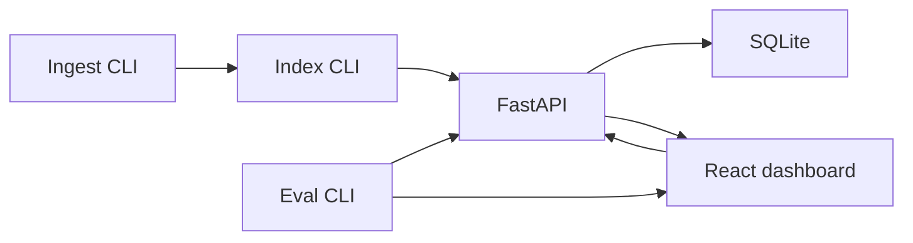

# Hybrid search + KPI dashboard

CPU-only hybrid search (BM25 + vectors) and a React KPI dashboard. Ingest and index CLIs, a FastAPI service, SQLite logs, and an eval CLI that writes a CSV. Two local processes: API on 8000, Vite on 5173 (proxies to the API).



fresh clone timing: ~12–18 min cold (`./up.sh` on Windows 11: venv + CPU torch/pip + npm ci + ingest + MiniLM index 16.99s for 359 docs / 384-dim); warm restart with artifacts present starts API + UI in under 15s.

All `python` commands below mean the venv interpreter after setup: Linux/macOS `.venv/bin/python`, Windows `.venv/Scripts/python.exe`. Run them from the repo root.

## Prerequisites

Install these on the machine before cloning:

- Git
- Python 3.11 or newer (`python --version`)
- Node 20 or newer, with `npm` on PATH (`node --version`, `npm --version`)
- Windows: [Git for Windows](https://git-scm.com/download/win) (includes Git Bash). PowerShell cannot run `up.sh`.

## Clone

```bash
git clone https://github.com/Jayant1634/Hybrid_Search_-_KPI_Dashboard__-Delivery_Plan.git
cd Hybrid_Search_-_KPI_Dashboard__-Delivery_Plan
```

Optional settings (defaults work without this). `up.sh` loads `backend/.env` if that file exists:

```bash
cp backend/.env.example backend/.env
```

## How to run

### 1. One command (Linux, macOS, or Git Bash)

From the repo root:

```bash
./up.sh
```

That script creates `.venv` if missing, installs CPU torch then `requirements.txt` and `pip install -e backend`, runs ingest + index only when `data/processed/docs.jsonl` or `data/index/metadata.json` are missing, runs `npm ci` in `frontend` if `node_modules` is missing, then starts both processes and prints:

- API: http://127.0.0.1:8000
- UI: http://127.0.0.1:5173

First search can take 20–30s while MiniLM loads. Stop with `./down.sh` or Ctrl+C in the `up.sh` terminal.

### 2. Windows PowerShell (do not run `./up.sh` here)

`./up.sh` in PowerShell returns immediately with no servers. The `bash` on PATH is often WSL, which is also the wrong interpreter.

Use Git Bash (`./up.sh`), or from PowerShell call Git's bash:

```powershell
& "C:\Program Files\Git\bin\bash.exe" ./up.sh
```

Stop the same way: Git Bash `./down.sh`, or

```powershell
& "C:\Program Files\Git\bin\bash.exe" ./down.sh
```

### 3. Manual install and run (no `up.sh`)

Use this if you want each step visible, or if bash is unavailable.

Linux / macOS:

```bash
python3 -m venv .venv
.venv/bin/python -m pip install --upgrade pip
.venv/bin/python -m pip install torch==2.14.0 --index-url https://download.pytorch.org/whl/cpu
.venv/bin/python -m pip install -r requirements.txt
.venv/bin/python -m pip install -e backend
.venv/bin/python -m app.ingest --input data/raw --out data/processed
.venv/bin/python -m app.index --input data/processed/docs.jsonl
npm ci --prefix frontend
```

Windows PowerShell (after Python 3.11+ and Node 20+ are on PATH):

```powershell
python -m venv .venv
.venv\Scripts\python.exe -m pip install --upgrade pip
.venv\Scripts\python.exe -m pip install torch==2.14.0 --index-url https://download.pytorch.org/whl/cpu
.venv\Scripts\python.exe -m pip install -r requirements.txt
.venv\Scripts\python.exe -m pip install -e backend
.venv\Scripts\python.exe -m app.ingest --input data/raw --out data/processed
.venv\Scripts\python.exe -m app.index --input data/processed/docs.jsonl
npm ci --prefix frontend
```

Start the API (repo root), then the UI in a second terminal:

```bash
# Linux / macOS
.venv/bin/python -m uvicorn app.api.main:create_app --factory --host 127.0.0.1 --port 8000
npm run dev --prefix frontend -- --host 127.0.0.1 --port 5173 --strictPort
```

```powershell
# Windows PowerShell
.venv\Scripts\python.exe -m uvicorn app.api.main:create_app --factory --host 127.0.0.1 --port 8000
npm run dev --prefix frontend -- --host 127.0.0.1 --port 5173 --strictPort
```

Windows-only API (no UI): `python backend/run.py` from the repo root, or `python run.py` from `backend/`, after the venv exists and is active.

## How to run tests

From the repo root, after the venv exists:

```bash
.venv/bin/python -m pytest backend/tests
# Windows:
.venv/Scripts/python.exe -m pytest backend/tests
```

Skip tests that load the real embedding model with `-m "not slow"`. Frontend has no test runner; `npm run build --prefix frontend` is the typecheck + production build.

## How to run eval

Eval scores the on-disk index in-process (the API does not need to be running). Build ingest + index first if `data/processed/docs.jsonl` or `data/index/metadata.json` are missing:

```bash
python -m app.ingest --input data/raw --out data/processed
python -m app.index --input data/processed/docs.jsonl
python -m app.eval --queries data/eval/queries.jsonl --qrels data/eval/qrels.json
```

`--queries` and `--qrels` default to those paths, so `python -m app.eval` is enough once the index exists.

Eval appends one row to `data/metrics/experiments.csv` (timestamp, commit, tag, alpha, normalization, model, nDCG@10, Recall@10, MRR@10). Optional flags: `--alpha`, `--normalization minmax|zscore`, `--tag`, `--model` (must match the index; rebuild with `python -m app.index --force` if it does not).

The Evaluation page on the dashboard reads that CSV after the next refresh.

## Experiments

```bash
./scripts/run_experiments.sh
```

Runs the FR-21 set (alpha sweep, z-score, alternate model, sentence-split) and restores the default ingest + index. Same shell rules as `up.sh`: Git Bash or Linux/macOS, not PowerShell.

## Break/fix

- Scenario A: Semantic index mismatch — [docs/break_fix_log.md](docs/break_fix_log.md#scenario-a-semantic-index-mismatch-s91)
- Scenario B: Schema migration break — [docs/break_fix_log.md](docs/break_fix_log.md#scenario-b-schema-migration-break-s92)
- Scenario C: Hybrid scoring regression — [docs/break_fix_log.md](docs/break_fix_log.md#scenario-c-hybrid-scoring-regression-s93)

## Deviations

None.

## Docs

- [Architecture](docs/architecture.md)
- [Business requirements](docs/requirements/business_requirements.md)
- [Functional requirements](docs/requirements/functional_requirements.md)
- [Technical requirements](docs/requirements/technical_requirements.md)
- [High-level design](docs/design/high_level_design.md)
- [Low-level design](docs/design/low_level_design.md)
- [Decision log](docs/decision_log.md)
- [Break/fix log](docs/break_fix_log.md)
- [Prompt log](docs/codex_log.md)
