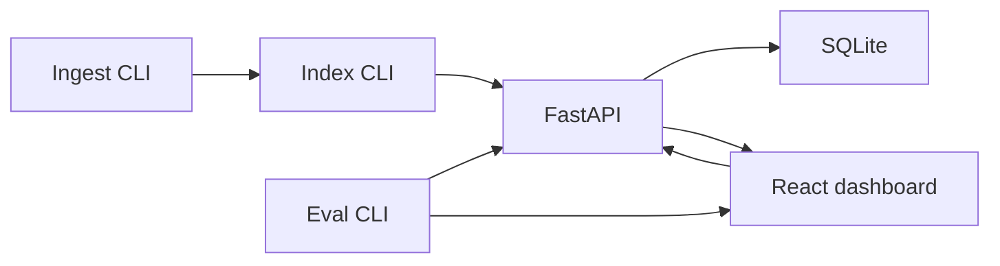

# Hybrid search + KPI dashboard

CPU-only hybrid search (BM25 + vectors) and a React KPI dashboard. Ingest and index CLIs, a FastAPI service, SQLite logs, and an eval CLI that writes a CSV. Two local processes: API on 8000, Vite on 5173 (proxies to the API).



fresh clone timing: ____

## Quickstart

Needs Python 3.11+, Node 20+, and git. On Windows use Git Bash.

```bash
./up.sh
```

- API: http://127.0.0.1:8000
- UI: http://127.0.0.1:5173

Stop with `./down.sh` or Ctrl+C in the `up.sh` terminal.

## Tests

From the repo root, after the venv exists (Linux/macOS `.venv/bin/python`, Windows Git Bash `.venv/Scripts/python.exe`):

```bash
.venv/bin/python -m pytest backend/tests
# Windows Git Bash:
.venv/Scripts/python.exe -m pytest backend/tests
```

Skip tests that load the real embedding model with `-m "not slow"`. Frontend has no test runner; `npm run build --prefix frontend` is the typecheck + production build.

## Ingest, index, eval

Run from the repo root with the venv Python (`python` below means `.venv/bin/python` or `.venv/Scripts/python.exe`):

```bash
python -m app.ingest --input data/raw --out data/processed
python -m app.index --input data/processed/docs.jsonl
python -m app.eval --queries data/eval/queries.jsonl --qrels data/eval/qrels.json
```

## Experiments

```bash
./scripts/run_experiments.sh
```

Runs the FR-21 set (alpha sweep, z-score, alternate model, sentence-split) and restores the default ingest + index.

## Break/fix

- Scenario A: Semantic index mismatch — [docs/break_fix_log.md](docs/break_fix_log.md#scenario-a-semantic-index-mismatch-s91)
- Scenario B: Schema migration break — [docs/break_fix_log.md](docs/break_fix_log.md#scenario-b-schema-migration-break-s92)
- Scenario C: Hybrid scoring regression — [docs/break_fix_log.md](docs/break_fix_log.md#scenario-c-hybrid-scoring-regression-s93)

## Deviations

None.

## Docs

- [Architecture](docs/architecture.md)
- [Business requirements](docs/requirements/business_requirements.md)
- [Functional requirements](docs/requirements/functional_requirements.md)
- [Technical requirements](docs/requirements/technical_requirements.md)
- [High-level design](docs/design/high_level_design.md)
- [Low-level design](docs/design/low_level_design.md)
- [Decision log](docs/decision_log.md)
- [Break/fix log](docs/break_fix_log.md)
- [Prompt log](docs/codex_log.md)
