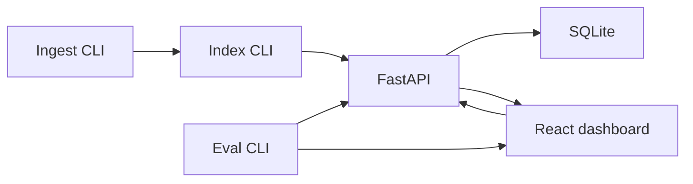
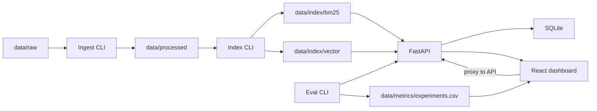

# High-level design

Parts: ingest CLI, index CLI, FastAPI, SQLite, React dashboard, eval CLI. Branching strategy is not in this file.

## Parts

| Part | Role |
| --- | --- |
| Ingest CLI | `python -m app.ingest --input data/raw --out data/processed`. Raw docs → JSONL (`doc_id`, `title`, `text`, `source`, `created_at`). |
| Index CLI | `python -m app.index --input data/processed/docs.jsonl`. Builds BM25 under `data/index/bm25/` and a CPU vector index under `data/index/vector/`, plus startup metadata. |
| FastAPI | Hybrid search API: `/health`, `/search`, `/metrics` (`/feedback` optional). Reads indexes; writes query logs and latency to SQLite. |
| SQLite | Local store for query logs and latency. Schema documented in README or `docs/architecture.md`. |
| React dashboard | Search, KPI, Evaluation, Debug. Talks to the API only (Vite proxy). |
| Eval CLI | `python -m app.eval --queries data/eval/queries.jsonl --qrels data/eval/qrels.json`. Writes nDCG@10, Recall@10, MRR@10 to `data/metrics/experiments.csv` with timestamp and git commit. |

## Overview

## Data movement

CLIs run on demand (or from `up.sh` when artifacts are missing). API and dashboard are the two long-running processes.

## One search request

1. User submits a query on the Search page.
2. Vite (`5173`) proxies `POST /search` `{query, top_k, alpha, filters}` to FastAPI (`8000`).
3. API runs BM25 over (title + text) and a vector query over the embedding index.
4. Scores are normalized (one of at least two strategies) and combined: `hybrid = alpha * norm_bm25 + (1-alpha) * norm_vector`.
5. API returns ranked hits with `bm25_score`, `vector_score`, `hybrid_score`, and highlight snippets.
6. API writes a structured JSON log (`request_id`, `query`, `latency_ms`, `top_k`, `alpha`, `result_count`, `error`) and persists query + latency in SQLite.
7. Dashboard renders the list and per-result score breakdown.

KPI, Debug, and Evaluation pages read logs/metrics through the API; Evaluation also shows `data/metrics/experiments.csv` (nDCG@10 trend).

## Local run

Two processes, started by `./up.sh` after ingest/index if artifacts are missing:

| Process | Port |
| --- | --- |
| FastAPI (Uvicorn) | 8000 |
| Vite (React) | 5173 |

Vite proxies API calls to port 8000. Browser uses the Vite URL only. CPU only; no cloud. Paths via pathlib; no absolute paths.

## Branching strategy
